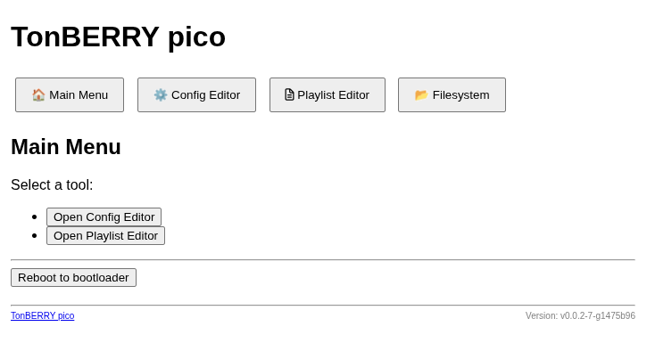

# TonBERRY pico - Aufbau- und Bedienungsanleitung

## Aufbau

Allgemeine Hinweise zum Aufbau:

* Das "interactive BOM" [hier](assets/ibom_rev1.2.html) gibt eine Übersicht darüber, wo welche
  Bauteile bestückt werden sollen

* Am besten erst die Einzelkomponenten (Widerstände, Kondensatoren, Dioden, Transistoren, Jumper)
  der (Bauteil-)Höhe nach sortiert von klein zu groß bestücken, dann können die Teile durch Auflegen
  auf eine Unterlage oder Einklemmen fixiert werden. Danach die Module bestücken.

* Wenn kein Akkubetrieb gewünscht ist, müssen die folgenden Bauteile nicht bestückt werden:
  * Adafruit Modul J4
  * Widerstände R1 und R3-5
  * Transistoren Q1 und Q2
  * Dioden D2 und D3
  * Jumper JP1, JP2 und JP4

* Der Widerstand R2 kann genutzt werden, um den Verstärkungsfaktor des Verstärkers grob
  einzustellen.  Der Verstärkungsfaktor hängt dabei vom Widerstandswert und der Verbindung ab, für
  R2 sind zwei verschiedene Bestückungspositionen vorgesehen. Es gibt die folgenden Stufen:
  * 100 kΩ nach 5V: 3 dB (empfohlener Standardwert)
  * 0 Ω nach 5V: 6 dB
  * nicht verbunden: 9 dB
  * 0 Ω nach GND: 12 dB
  * 100 kΩ nach GND: 15 dB

* Der Reset-Taster SW5 muss nur bestückt werden, wenn man das Gerät benutzten will um selbst an der
  Software zu entwickeln.

* Die "primäre" USB-Buchse ist der micro-USB Anschluss des Raspberry Pi Pico W. Der USB-Anschluss
  auf dem BQ25185-Module kann zwar genutzt werden um das Gerät mit Strom zu versorgen. Es ist aber
  ohne weiteres keine Datenverbindung möglich um die Software zu installieren.

## Inbetriebnahme

### Softwareinstallation

Eine microSD-Karte mit FAT32 Dateisystem formatieren und in den microSD Slot einsetzen. Es können
bereits mp3-Dateien auf die SD Karte kopiert werden. Die Karte sollte aber nicht komplett voll sein,
da eine interne Playlist-Datenbank ebenfalls auf der SD-Karte abgelegt wird und ggf. über die Zeit
größer werden wird. Empfohlen wird, etwa 10 MB frei zu lassen.

Zur Erstinstallation die Firmware `firmware-filesystem-Rev1.uf2` auf den Raspberry Pi Pico W
installieren. Dazu die "BOOTSEL"-Taste auf dem Pi Pico gedrückt halten und währenddessen das Gerät
über die Micro-USB Buchse auf dem Pi Pico mit dem PC verbinden. Es sollte dann ein USB-Laufwerk
auftauchen. Die "BOOTSEL"-Taste kann nun losgelassen werden. Dann die Datei
`firmware-filesystem-Rev1.uf2` auf das USB-Laufwerk kopieren.

> [!IMPORTANT]
>
> Für spätere Softwareaktualisierungen sollte die Datei `firmware-Rev1.uf2` benutzt werden, um die
> auf dem Gerät gespeicherte Konfiguration zu behalten. Mit der Datei `firmware-filesystem-Rev1.uf2`
> wird die gespeicherte Konfiguration überschrieben und in den Initialzustand zurückgesetzt. Dies
> betrifft u.a. die Anmeldeinformationen für ein WiFi, falls diese gesetzt wurden.

### Konfiguration

Es gibt zwei Speicherorte auf dem Gerät. Auf der SD-Karte wird die Datenbank abgelegt, in welcher die
Playlisten und die Zuordnung von NFC-Tags zu Playlisten gespeichert sind.

Auf dem Pi Pico selbst wird die Systemkonfiguration gespeichert. Hier werden die Informationen zum
WLAN-Zugang, zur Tastenbelegung und weitere Konfigurationsdaten gespeichert. 

Somit bleibt einerseits die Systemkonfigurationsdaten auf dem Gerät erhalten, selbst wenn die
SD-Karte getauscht wird. Andererseits wandern die Playlisten und Tags mit der SD-Karte mit, wenn
z.B. die SD-Karte in ein anderes Gerät eingesetzt wird.

Nach der Erstinstallation öffnet das Gerät einen WLAN-Accesspoint mit der SSID
"TonberryPicoAP_abcdef0123456789" auf, wobei der Teil "abcdef0123456789" individuell von der
Seriennummer des Pi Pico abhängig ist. Nach einer Verbindung mit diesem AP kann die Seite
<http://192.168.4.1> aufgerufen werden.  Die Startseite des Webinterfaces wird angezeigt:

Durch klicken auf die "Config Editor" Schaltfläche gelangt man zum "Configuration Editor". Hier kann
die Systemkonfiguration editiert werden.

#### Button map

Es können bis zu 5 Taster an das Gerät angeschlossen werden. Die Funktion der Tasten ist, bis auf
das Einschalten, frei konfigurierbar.  Eingeschaltet wird das Gerät immer über die Taste, die an
"GP21" angeschlossen ist (Pin 2 von J7).

In der Konfiguration werden die Tasten durch Ziffern von 0 bis 4 identifiziert. Die Zuordnung auf
der Rev. 1.2-Platine ist wie folgt:

| Button map  | GPIO Pin  | J7 Pin |
|-------------|-----------|--------|
| 0           | GP17      | 5      |
| 1           | GP18      | 4      |
| 2           | GP19      | 3      |
| 3           | GP20      | 6      |
| 4           | GP21      | 2      |

Jeder Taste sollte nur eine Funktion zugeordnet werden.

#### WLAN

Im Ausgangszustand strahlt der Tonberry Pico eine eigene SSID aus und bietet so ein
unverschlüsseltes WiFi an. Die SSID lautet `TonberryPicoAP_<UID>`. Der TonberryPico ist unter der
IP-Addresse 192.168.4.1 erreichbar und verteilt Addressen aus dem Subnetz 255.255.255.0 per
DHCP.

Da der Tonberry WLAN als primäre Konfigurations- und Uploadschnittstelle nutzt, kann das WLAN nicht
abgeschalten werden.

Um einem bestehenden WLAN beizutreten, den Netzwerknamen unter "Network name" eingeben. Das Passwort
in das Feld "Password" eingeben. Mit "Security mode" kann die Verschlüsselungsart des Netzwerks
eingestellt werden. Der TonberryPico bezieht eine IP-Addresse per DHCP. Der TonberryPico ist unter
<http://tonberrypico.local> per mDNS auflösbar.

Wenn der Tonberry einen eigenen WLAN-Accesspoint aufmachen soll, das Feld "Network name"
freilassen. Auch hier können über "Password" und "Security mode" das Passwort und die
Verschlüsselungsart eingestellt werden.

#### Sonstige Einstellungen

* **Tag removal timeout (seconds)** Wie lange es dauert, bis ein nicht mehr erkannter NFC-Tag als
  entfernt gilt. In Abhängigkeit von Tag, Abstand zum Leser und Umgebungsbedingungen kann es zu
  kurzzeitigen Aussetzern in der NFC-Kommunikation kommen. Mit dieser Einstellung kann man
  verhindern dass die Musikwiedergabe in solchen Fällen ungewollt angehalten wird.

* **Tag mode**: Hier kann zwischen zwei Wiedergabemodi gewechselt werden:
  * **Play until tag is removed**: Die Musik spielt, solange der NFC-Tag vom Gerät erkannt wird. Wird der
    Tag (für mehr als "Tag removal timeout" Sekunden) entfernt, stoppt die Wiedergabe.
  * **Present tag once to start, present again to stop playback**: Die Musik fängt an zu spielen wenn
    ein Tag erkannt wird. Der Tag muss nicht auf dem Gerät bleiben. Durch erneutes Vorhalten
    desselben Tags nach einer kurzen Wartezeit kann die Wiedergabe gestoppt werden. Beim Vorhalten
    eines anderen Tags wechselt die Wiedergabe auf die Playlist des neuen Tags.

* **Maximum LED brightness**: Helligkeit der WS2812 LEDs, 0 - 255.

* **Maximum volume**: Begrenzung der maximale Lautsärke, 0 - 255.

> [!TIP]
> Die tatsächliche Lautstärke hängt von der Bestückung des Widerstands R2 (siehe [Aufbau](#Aufbau)) und
> der abgespielten mp3 Datei ab.

* **Volume at startup**: Initiale Lautstärke nach dem Einschalten, 0 - 255.

* **Idle timeout (seconds)**: Nur im Akkubetrieb: Wie lange das das Gerät bei pausierter oder gestoppter
  Musikwiedergabe wartet, bevor es sich ausschaltet.

* **Length of WS2812 / Neopixel LED chain**: Wieviele RGB-LEDs hintereinander am LED-Anschluss
  angeschlossen sind.

#### Speichern

Durch klicken auf "Save & Reboot" werden die Einstellungen gespeichert. Das Gerät startet dann neu
um die Einstellungen anzuwenden. Danach muss man sich ggf. neu mit den WLAN des Geräts verbinden.

Wenn man durch einen Fehler bei der WLAN-Konfiguration nicht mehr auf die Konfigurationsseite
zugreifen kann, gibt es im Abschnitt "Besondere Tastenkombinationen" Abhilfe.

## Benutzung

### Grundfunktionen

Das Gerät wird durch die Power-Taste (Akkubetrieb) oder durch Einstecken des USB Kabels
eingeschalten.

Nach dem Einschalten des Geräts leuchten die LEDs erst kurz Gelb ("Gerät startet"), und pulsieren
danach langsam grün ("Gerät bereit").

Durch Auflegen eines Tags, für den eine Playlist konfiguriert ist, kann die Musikwiedergabe
gestartet werden. Die LED(s) leuchten in einem Regenbogenmuster. Die Tasten "Vor" ("Next track") und
"Zurück" ("Previous track") erlauben zum vorherigen oder nächsten Track zu springen. Die Taste "Play/Pause"
pausiert die Musikwiedergabe oder nimmt sie wieder auf.

Mit den Tasten "lauter" ("Volume up") und "leiser" ("Volume down") kann die Lautstärke bis zur
konfigurierten Maximallautstärke verändert werden.

### Playlisten-Verwaltung

Im Webinterface kann durch Klicken auf "Playlist Editor" der Playlist-Editor geöffnet werden.

#### Anlegen einer Playlist

Entweder die Tag-ID eingeben, oder den Tag auf das Gerät legen und auf "Get last tag" klicken um die
Tag-ID des zuletzt aufgelegten Tags auszulesen. Danach auf "New playlist" klicken um eine neue
Playlist anzulegen. Die Webseite wechselt dann in den Dialog zum Bearbeiten der Playlist (siehe nächster
Abschnitt).

> [!WARNING]
> Wenn bereits eine Playlist für das Tag-ID existiert, wird diese überschrieben.

#### Bearbeiten einer Playlist

Durch Auswählen einer existierenden Playlist im "Playlists"-Feld und klicken auf "Edit playlist"
kann eine bestehende Playlist bearbeitet werden.

Im oberen Bereich kann jetzt der Wiedergabetyp "Playlist type" und der Name der Playlist eingestellt
werden.

Im unteren Bereich können die auf der SD-Karte gespeicherten MP3-Dateien zur Playlist hinzugefügt,
gelöscht oder neu angeordnet werden. Nach dem Klick auf "Add tracks" wechselt die Ansicht in eine
Dateisystemansicht. Hier können MP3-Dateien ausgewählt werden, um zur Playlist hinzugefügt zu
werden. Das Hochladen von neuen MP3-Dateien ist in dieser Ansicht auch möglich.

Die fertige Playlist muss mit einem Klick auf "Save" gespeichert werden.

### Besondere Tastenkombinationen

Zur Nummerierung der Tasten siehe [Button map](#button-map).

* Standard WLAN Konfiguration laden: Wenn beim Start die Taste 1 gehalten wird, blinken die LED(s)
  einmal blau. Das Gerät benutzt dann temporär die WLAN Standardkonfiguration und macht einen
  offenen WLAN-Accesspoint mit dem Namen "TonberryPicoAP_abcdef0123456789" auf, wobei der Teil
  "abcdef0123456789" individuell von der Seriennummer des Pi Pico abhängig ist. Damit kann bei
  fehlerhafter WLAN-Konfiguration wieder auf die Konfigurationsseite zugegriffen werden, um die
  WLAN-Konfiguration zu korrigieren.
  
* Ausschalten: Durch langes Gedrückthalten der Taste "leiser" kann das Gerät ausgeschaltet (im
  Akkubetrieb) oder neu gestartet (im USB-Betrieb) werden.
  
* Entwicklermodus: Durch Gedrückthalten der Taste 0 beim Start wird der Start der Software
  unterbrochen (die LEDs leuchten rot). In diesem Modus kann, wenn das Gerät per USB verbunden ist,
  mit dem `mpremote`-Tool mit der MicroPython-Shell interagiert werden.
